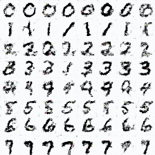
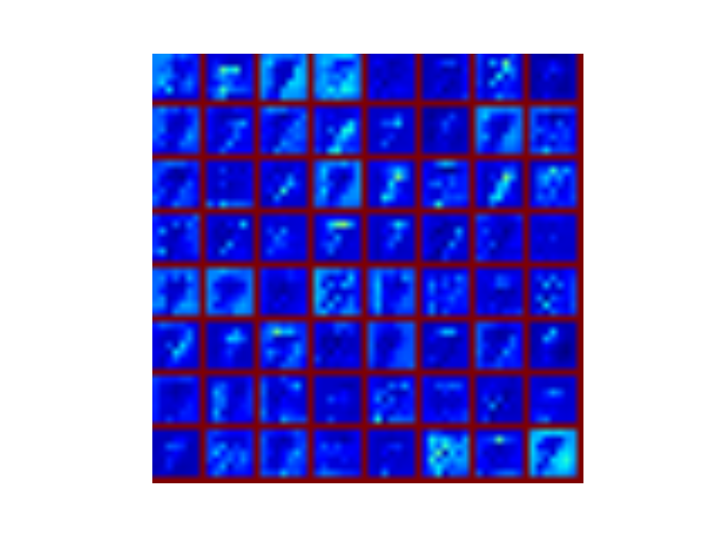

# Conditional-Gans
The test code for Conditional Generative Adversarial Nets using tensorflow.

## INTRODUCTION

Tensorflow implements of [Conditional Generative Adversarial Nets](https://arxiv.org/abs/1411.1784).The paper should be the first one to introduce Conditional GANS.But they did not provide source codes.My code has some differences comparing the paper:The Gans is based on Convolution network and the code refer to [DCGAN](https://github.com/carpedm20/DCGAN-tensorflow).

## Prerequisites

- tensorflow >=1.0

- python 2.7

- opencv 2.4.8

- scipy 0.13

## Usage

  Download mnist:
  
    $ python download.py mnist
  
  Train:
  
    $ python main.py --op 0
  
  Test:
  
    $ python main.py --op 1
  
  Visualization:
  
    $ python main.py --op 2
    
  GIF:
  
    $ python make_gif.py
  
## Result on mnist

## Visualization:

the visualization of weights:

the visualization of activation:

## Reference code

[DCGAN](https://github.com/carpedm20/DCGAN-tensorflow)
